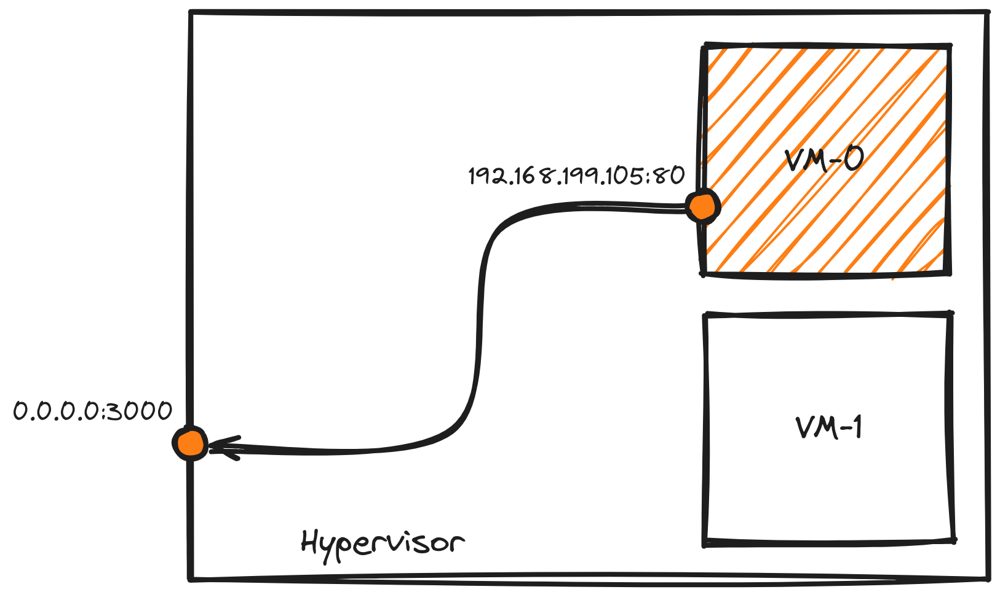

# fwdctl


[](https://pkg.go.dev/github.com/alegrey91/fwdctl)
[](https://goreportcard.com/report/github.com/alegrey91/fwdctl)
[](https://raw.githack.com/wiki/alegrey91/fwdctl/coverage.html)


**fwdctl** is a simple and intuitive CLI to manage forwards in your **Linux** server.

## How it works

It essentially provides commands to manage forwards, using **iptables** under the hood.

Let's do an example:

Suppose you have an **hypervisor** server that hosts some virtual machines inside itself. If you need to expose an internal service, managed by one of these VMs, you can use **fwdctl** from the hypervisor to add the forward to expose this service.



To do so, you have to type this easy command: 

``` shell
sudo fwdctl create --destination-port 3000 --source-address 192.168.199.105 --source-port 80
```

That's it.

Full **documentation** [here](docs/getting-started.md).

## Installation

#### Linux x86_64

```shell
curl -s https://raw.githubusercontent.com/alegrey91/fwdctl/main/install | sudo sh
```

